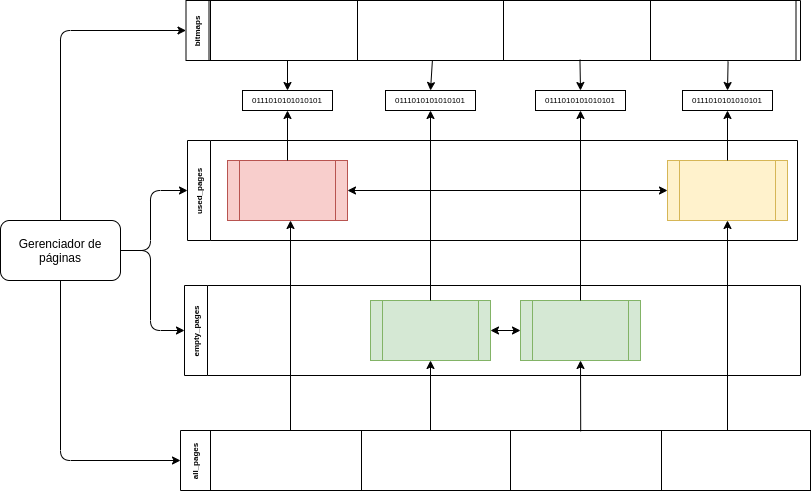
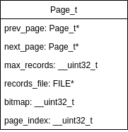

# **SGBD**

## **Trabalho 1**

### **Arquitetura**

Implementação de um simulador de gerenciador de páginas para registros de tamanho fixo.

**Arquitetura do gerenciador:**



As páginas em verde são as páginas vazias, enquanto as vermelhas estão completamente cheias e as amarelas parcialmente preenchidas.

O vetor _all_pages_ é um vetor contendo referência para todas as páginas independente dos seus estados (vazios ou utilzados). Semelhante, o vetor bitmaps contém referência para todos os bitmaps individuais de cada página.

---

**Arquitetura da página:**



- **_prev\_page_ ,_next\_page_:**  São os ponteiros manipulados dinamicamente a medida que uma página é esvaziada ou utilizada.
- **_max\_records_:** Número total de registros que aquela página pode receber.
- **_records\_file_:** Arquivo onde é realizada a persistência dos dados.
- **_bitmap_:** Inteiro de 32 bits utilizado para mapear cada bit em um slot informando se o mesmo está isponível ou não. Devido ao tipo utilizado, cada página só pode ter no máximo 32 registros.
- **_page\_index_:** Índice que indica a posição da página dentro de _all\_pages.

### Compilação e Execução

```bash
gcc src/*.c [tests|main].c -o [tests|main].exe
./main.exe <n_pages> <n_records>
```

---
